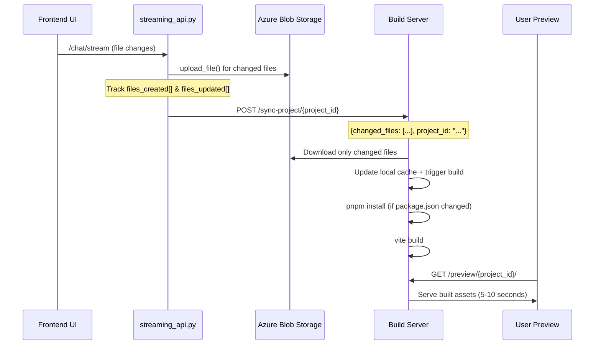

# Fast Preview System: Detailed Implementation Plan

## Current Architecture Analysis

### Azure Storage System (from base_test_azure_hybrid.py)
- **Project Creation**: `create_project_via_cloud_storage()` clones GitHub repos to Azure Blob Storage
- **File Structure**: Projects stored as `{project_id}/frontend/` and `{project_id}/backend/`
- **File Operations**: `cloud_storage.upload_file()` and `cloud_storage.download_file()` handle individual files
- **File Scanning**: `_scan_project_files_via_cloud_storage()` gets file lists without content download

### File Tracking System (from streaming_api.py)
- **StreamingModelWrapper**: Tracks `files_created[]` and `files_updated[]` during conversations
- **File Tracking**: Lines 546-557 track file operations in real-time during streaming
- **Change Detection**: Already knows exactly which files were modified after each streaming session

## Infrastructure Architecture

### 1. Azure Build Server VM
- [ ] **VM Spec**: Standard_F4s_v2 (4 vCPU, 8GB RAM, 32GB temp SSD)
- [ ] **Cost**: ~$30/month with Azure Spot pricing
- [ ] **Storage**: Premium SSD v2 (1TB) for project caching (~$15/month)
- [ ] **OS**: Ubuntu 22.04 LTS
- [ ] **Software Stack**: Node.js 18+, pnpm, PM2, nginx

### 2. Build Server API (Node.js/Express)
```javascript
// Main endpoints
POST /sync-project/{project_id}        // Sync changed files from Azure
POST /build/{project_id}               // Trigger build
GET /preview/{project_id}/*            // Serve built assets
GET /logs/{project_id}                 // Get build logs/errors
```

### 3. Directory Structure on Build Server
```
/opt/build-server/
├── api/                              # Build server API
├── projects/
│   └── {project_id}/
│       ├── frontend/                 # Source files (synced from Azure)
│       │   ├── src/
│       │   ├── package.json
│       │   └── .file-hashes.json     # SHA-256 hashes of each file
│       ├── dist/                     # Built assets (served to users)
│       ├── build.log                 # Build output/errors
│       └── .build-status             # build status (building/ready/error)
├── shared-store/                     # pnpm global store (~90% space saving)
└── workspace/                        # pnpm workspace root
```

## Implementation Details

### 1. Integration with Existing Azure System

#### File Sync Flow


#### Modified streaming_api.py Integration
- [ ] **After streaming session**: Extract `files_created` and `files_updated` from StreamingModelWrapper
- [ ] **Webhook call**: POST to build server with changed files list
- [ ] **Hash comparison**: Build server compares file hashes to determine actual changes

### 2. File Change Detection System

#### Hash-Based Change Detection
```javascript
// On build server
class ProjectManager {
    async syncProject(projectId, changedFiles) {
        const localHashes = await this.loadFileHashes(projectId);
        const filesToUpdate = [];
        
        for (const file of changedFiles) {
            const azureContent = await azureStorage.downloadFile(projectId, file.path);
            const newHash = crypto.createHash('sha256').update(azureContent).digest('hex');
            
            if (localHashes[file.path] !== newHash) {
                // File actually changed - update local copy
                await fs.writeFile(`projects/${projectId}/frontend/${file.path}`, azureContent);
                localHashes[file.path] = newHash;
                filesToUpdate.push(file.path);
            }
        }
        
        if (filesToUpdate.length > 0) {
            await this.triggerBuild(projectId);
        }
    }
}
```

### 3. Build Process Optimization

#### pnpm Shared Dependencies
```bash
# Build server setup
pnpm config set store-dir /opt/build-server/shared-store
cd /opt/build-server/workspace

# For each project
cd projects/{project_id}/frontend
pnpm install --frozen-lockfile  # Uses shared store
pnpm run build                   # Output to dist/
```

#### Incremental Builds
- [ ] **Vite Watch Mode**: `vite build --watch` runs continuously for active projects
- [ ] **Build Caching**: Vite's built-in caching + our file-level hashing
- [ ] **Smart Rebuilds**: Only rebuild when source files actually change (not just timestamps)

### 4. Build Server API Details

#### Express.js Server with PM2
```javascript
// /opt/build-server/api/server.js
const express = require('express');
const crypto = require('crypto');
const fs = require('fs').promises;
const { spawn } = require('child_process');

app.post('/sync-project/:projectId', async (req, res) => {
    const { projectId } = req.params;
    const { changed_files } = req.body;
    
    try {
        const updateResult = await syncProjectFiles(projectId, changed_files);
        
        if (updateResult.hasChanges) {
            // Trigger build in background
            triggerBuild(projectId);
            res.json({ status: 'building', changes: updateResult.changes });
        } else {
            res.json({ status: 'no_changes' });
        }
    } catch (error) {
        res.status(500).json({ error: error.message });
    }
});

app.get('/preview/:projectId/*', express.static('projects'));
```

## Updated streaming_api.py Integration

### Modified StreamingModelWrapper
```python
# Add after line 717 in streaming_api.py
async def _notify_build_server(self):
    """Notify build server of file changes after streaming session"""
    if not (self.files_created or self.files_updated):
        return
        
    project_id = getattr(self.model_system, 'project_id', None)
    if not project_id:
        return
        
    changed_files = []
    for file_path in self.files_created + self.files_updated:
        changed_files.append({"path": file_path, "type": "frontend"})
    
    try:
        import aiohttp
        async with aiohttp.ClientSession() as session:
            async with session.post(
                f"http://build-server.azure.com/sync-project/{project_id}",
                json={"changed_files": changed_files}
            ) as response:
                result = await response.json()
                print(f"🔨 Build server notified: {result}")
    except Exception as e:
        print(f"⚠️ Failed to notify build server: {e}")
```

## Performance Expectations

### Before (WebContainer)
```
File Change → Download All Files (30s) → npm install (2-4min) → WebContainer Start (30s) → Preview
Total: 5+ minutes per change
```

### After (Build Server)
```
File Change → Hash Compare (100ms) → Download Changed Files (1-3s) → Incremental Build (3-8s) → Preview
Total: 5-12 seconds per change
```

## Implementation Tasks

### Phase 1: Build Server Setup (Week 1)
- [ ] Provision Azure VM (F4s_v2 with Premium SSD v2)
- [ ] Install Node.js 18+, pnpm, nginx, PM2 on VM
- [ ] Setup project directory structure `/opt/build-server/`
- [ ] Configure pnpm shared store at `/opt/build-server/shared-store/`
- [ ] Create basic Express API server with endpoints
- [ ] Implement file sync endpoint `POST /sync-project/{project_id}`
- [ ] Test basic build process with sample Vite project
- [ ] Setup PM2 process management for API server

### Phase 2: Azure Integration (Week 2)
- [ ] Add Azure SDK to build server for Blob Storage access
- [ ] Implement file hash comparison system using SHA-256
- [ ] Create `ProjectManager` class for handling project sync
- [ ] Setup Azure Blob Storage connection on build server
- [ ] Test file sync from Azure to build server
- [ ] Implement incremental file updates (only changed files)
- [ ] Add build status tracking (`.build-status` files)
- [ ] Create build logging system (`build.log` files)

### Phase 3: streaming_api.py Modifications (Week 2)
- [ ] Add `_notify_build_server()` method to `StreamingModelWrapper` 
- [ ] Modify `_save_streaming_chunks_batch()` to call build server after streaming
- [ ] Add aiohttp dependency for async HTTP requests
- [ ] Configure build server URL in environment variables
- [ ] Test streaming session → build server notification flow
- [ ] Add error handling for build server communication failures
- [ ] Test file tracking integration with build server

### Phase 4: Preview System (Week 3)
- [ ] Create static file serving endpoints `GET /preview/{project_id}/*`
- [ ] Implement project-specific routing in Express
- [ ] Add build process monitoring with status checks
- [ ] Setup nginx reverse proxy for performance and caching
- [ ] Test preview loading speeds (target: 5-10 seconds)
- [ ] Add build caching mechanisms for unchanged projects
- [ ] Create build queue system for handling multiple concurrent builds
- [ ] Test concurrent project builds and resource management

### Phase 5: Basic Error Handling & Logging (Week 3)
- [ ] Add comprehensive logging to build process
- [ ] Implement build failure detection and reporting
- [ ] Create basic build logs endpoint `GET /logs/{project_id}`
- [ ] Add timeout handling for long builds
- [ ] Test error scenarios (missing files, build failures, etc.)
- [ ] Add health check endpoint for build server monitoring

### Phase 6: UI Integration (Week 4)
- [ ] Add "Fast Preview" toggle in existing UI
- [ ] Create preview iframe component that points to build server
- [ ] Implement real-time build status display (building/ready/error)
- [ ] Add loading indicators for build process
- [ ] Test iframe integration and cross-origin handling
- [ ] User acceptance testing with real projects
- [ ] Add fallback to WebContainer if build server unavailable

### Phase 7: Basic Console Integration (Week 4)
- [ ] Create simple console log injection script for built apps
- [ ] Implement basic parent-child communication via postMessage
- [ ] Add simple console logs panel in UI (optional)
- [ ] Test basic error reporting from preview iframe

## Cost Analysis

- **Azure VM F4s_v2**: ~$30/month (Spot pricing)
- **Premium SSD v2 (1TB)**: ~$15/month  
- **Bandwidth**: ~$5/month
- **Total**: ~$50/month for 100k+ projects

**Cost per project per month**: ~$0.0005 (incredible efficiency)

This architecture eliminates the 5+ minute WebContainer load times and provides instant previews with basic debugging capabilities.

## Success Metrics

- [ ] **Preview Load Time**: Target 5-12 seconds (vs 5+ minutes currently)
- [ ] **File Sync Time**: Target 1-3 seconds for changed files only
- [ ] **Build Time**: Target 3-8 seconds for incremental builds
- [ ] **Resource Efficiency**: 90% reduction in node_modules storage via pnpm
- [ ] **Cost Efficiency**: Support 100k+ projects for $50/month
- [ ] **Reliability**: 99%+ uptime for preview system
- [ ] **User Experience**: Instant preview updates after file changes