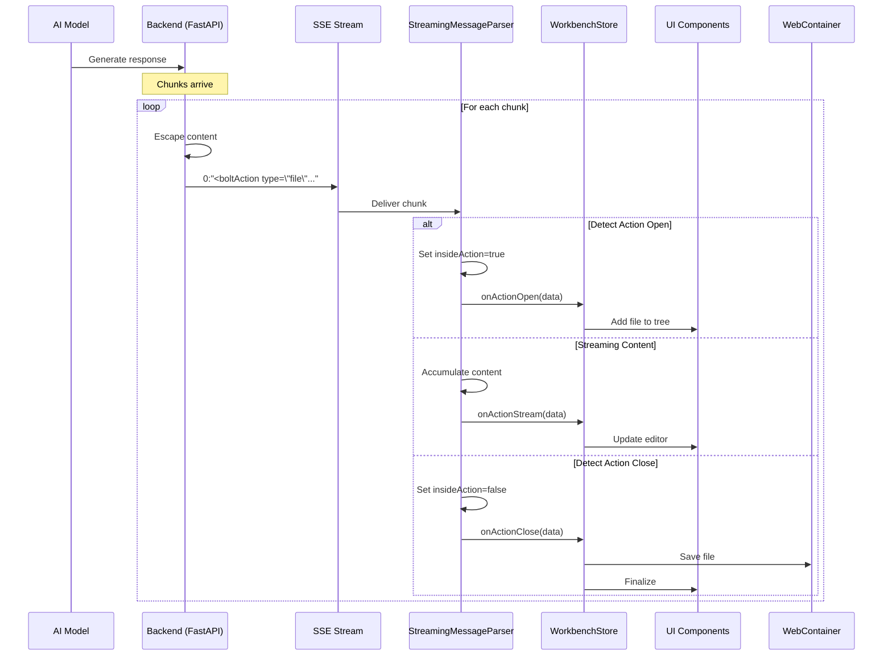

# Bolt.diy Streaming Flow Diagram

## Complete Flow: From AI Response to UI Update



## State Machine Diagram

```
┌─────────────────────────────────────────────────────────────────┐
│                     StreamingMessageParser                       │
│                                                                  │
│  ┌────────┐         ┌──────────────┐         ┌──────────────┐  │
│  │  IDLE  │──tag──>│ IN_ARTIFACT  │──tag──>│  IN_ACTION   │  │
│  └────────┘         └──────────────┘         └──────────────┘  │
│      ▲                     │                         │          │
│      │                     │                         │          │
│      └─────────close───────┴────────close───────────┘          │
│                                                                  │
│  Callbacks:                                                      │
│  • onArtifactOpen  • onActionOpen   • onActionStream            │
│  • onArtifactClose • onActionClose                              │
└─────────────────────────────────────────────────────────────────┘
```

## Data Flow for Different Action Types

### 1. File Creation/Update Flow

```
Stream: 0:"<boltAction type=\"file\" filePath=\"App.tsx\">"
         ↓
Parser: Detects file action → onActionOpen
         ↓
Store:  addAction() → Creates file entry in UI
         ↓
Stream: 0:"import React from 'react';"
         ↓
Parser: Accumulates content → onActionStream
         ↓
Store:  runAction(streaming=true) → Updates editor in real-time
         ↓
Stream: 0:"</boltAction>"
         ↓
Parser: Completes action → onActionClose
         ↓
Store:  saveFile() → Writes to WebContainer filesystem
```

### 2. Shell Command Flow

```
Stream: 0:"<boltAction type=\"shell\">npm install</boltAction>"
         ↓
Parser: Detects complete shell action → onActionClose
         ↓
Store:  runAction() → Executes in WebContainer terminal
         ↓
Terminal: Shows command output in real-time
```

### 3. Start Command Flow

```
Stream: 0:"<boltAction type=\"start\">npm run dev</boltAction>"
         ↓
Parser: Detects start action → onActionClose
         ↓
Store:  runAction() → Starts dev server
         ↓
Preview: Opens preview pane with running application
```

## Component Responsibilities

### Backend (`chat_service.py`)
- Receives AI response stream
- Formats as SSE chunks: `0:"content"`
- Handles escaping of special characters
- Maintains streaming connection

### Parser (`message-parser.ts`)
- **State Management**: Tracks parsing position and context
- **Pattern Detection**: Identifies bolt tags
- **Content Accumulation**: Builds complete actions
- **Callback Emission**: Triggers appropriate handlers

### Workbench Store (`workbench.ts`)
- **Action Queue**: Manages execution order
- **File System**: Interfaces with WebContainer
- **Editor State**: Manages open files and changes
- **Terminal**: Executes commands

### UI Components
- **File Tree**: Shows project structure
- **Editor**: Displays and edits code
- **Terminal**: Shows command output
- **Preview**: Displays running application

## Real-time Update Mechanism

```typescript
// 1. Parser detects streaming content
onActionStream: (data) => {
  // 2. Update editor immediately (don't wait for save)
  workbenchStore.updateFile(data.filePath, data.content)
  
  // 3. Debounced save to filesystem
  actionStreamSampler(data)  // 100ms debounce
}

// 4. Final save when action completes
onActionClose: (data) => {
  workbenchStore.saveFile(data.filePath)
}
```

## Error Handling Flow

```
┌─────────┐     ┌─────────┐     ┌─────────┐
│ Stream  │────▶│ Parser  │────▶│  Store  │
└─────────┘     └─────────┘     └─────────┘
     │               │                │
     ▼               ▼                ▼
  Timeout?     Invalid Tag?     Save Failed?
     │               │                │
     └───────────────┴────────────────┘
                     │
                     ▼
              Display Error in UI
```

## Performance Optimizations

1. **Streaming Updates**: Files update character-by-character
2. **Debounced Saves**: Prevents excessive filesystem writes
3. **Action Queue**: Ensures commands run in correct order
4. **State Preservation**: Parser maintains state between chunks
5. **Selective Rendering**: Only affected components update