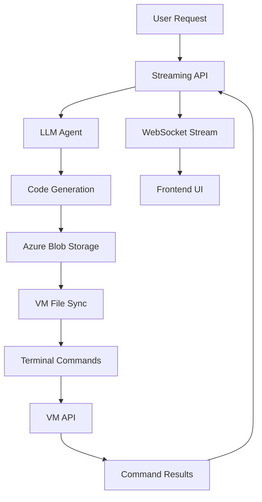

# System Architecture Documentation

## Overview

Bolt.DIY is a meta-development platform that uses AI to generate complete applications. It's not a single application but a system that creates other applications.

## Core Architecture Flow



## Component Details

### 1. Frontend (React + Vite)
**Location:** `/frontend`
**Purpose:** User interface for interacting with the AI agent

- **Chat Interface**: Real-time communication with LLM
- **Code Editor**: View and edit generated files
- **Terminal**: Execute commands in project context
- **Project Management**: Create, list, and manage projects

### 2. Streaming API Server
**Location:** `/backend/api_server/streaming_api.py`
**Purpose:** Central hub for all client-server communication

- **WebSocket Management**: Real-time bidirectional communication
- **Request Routing**: Directs requests to appropriate handlers
- **Response Streaming**: Chunks responses for real-time updates
- **Session Management**: Tracks conversation and project state

### 3. LLM Agent System
**Location:** `/backend/api_server/agent_class.py`
**Purpose:** Core AI logic for code generation

- **Prompt Processing**: Interprets user requirements
- **Code Generation**: Creates/modifies files based on requirements
- **Error Handling**: Implements retry logic and fallbacks
- **Tool Integration**: Manages file operations and terminal commands

### 4. Cloud Storage Integration
**Location:** `/backend/api_server/cloud_storage.py`
**Purpose:** Persistent storage for all project files

#### Azure Blob Storage Structure:
```
codebase-projects/
├── project-123/
│   ├── frontend/
│   │   ├── src/
│   │   ├── package.json
│   │   └── ...
│   └── backend/
│       ├── app.py
│       ├── requirements.txt
│       └── ...
├── project-456/
│   └── ...
```

### 5. VM Terminal API
**Location:** `/vm-api/` (deployed on VM)
**Purpose:** Secure terminal command execution

- **Command Execution**: Runs terminal commands in project context
- **File System Access**: Manages project directories on VM
- **Output Streaming**: Returns real-time command output
- **Security**: Sandboxed execution environment

### 6. Project Boilerplates
**Location:** `/backend/backend-boilerplate-clone/` and `/backend/frontend-boilerplate-clone/`
**Purpose:** Templates for generated applications

- **Backend Template**: FastAPI application with Modal.com deployment
- **Frontend Template**: React application with Tailwind CSS
- **Customization Points**: Predefined hooks for AI modifications

## Data Flow Sequences

### 1. Project Creation Flow
```
1. User: "Create a task management app"
2. Frontend → WebSocket → Streaming API
3. Streaming API → Agent: Process request
4. Agent → Generate project ID
5. Agent → Copy boilerplate templates
6. Agent → Customize files based on requirements
7. For each file:
   a. Agent → Azure Storage: Upload file
   b. Azure Storage → VM Sync: Sync to VM
8. Agent → Return project ID to user
```

### 2. File Editing Flow
```
1. User: "Add a delete button to tasks"
2. Agent → Read existing file from Azure
3. Agent → Modify file content
4. Agent → Upload to Azure Storage
5. Azure Storage → VM Sync: Update file on VM
6. Agent → Stream changes to frontend
```

### 3. Terminal Command Flow
```
1. User: "npm install axios"
2. Agent → VM API: Execute command
3. VM API → Run in project directory
4. VM API → Stream output back
5. Agent → Forward output to frontend
```

### 4. Backend Deployment Flow
```
1. Agent → Package backend code
2. Agent → Deploy to Modal.com
3. Modal → Return deployment URL
4. Agent → Store URL in project metadata
5. Frontend → Use deployed backend URL
```

## Key Design Decisions

### 1. Why Azure Blob Storage?
- **Scalability**: Handles unlimited projects and files
- **Durability**: Built-in redundancy and backup
- **Cost-effective**: Pay only for storage used
- **Integration**: Easy SDK for Python/JavaScript

### 2. Why Separate VM for Terminal?
- **Security**: Isolated execution environment
- **Flexibility**: Full Linux environment for any command
- **Persistence**: Project files remain on VM
- **Real-time**: Direct command execution without containers

### 3. Why Streaming Architecture?
- **User Experience**: Real-time feedback during generation
- **Efficiency**: No polling required
- **Scalability**: Handles concurrent users efficiently
- **Flexibility**: Supports long-running operations

### 4. Why Modal.com for Deployment?
- **Serverless**: No infrastructure management
- **Fast**: Quick deployment and scaling
- **Cost-effective**: Pay per execution
- **Python-native**: Excellent Python support

## Security Architecture

### 1. API Key Management
- Environment variables for sensitive keys
- Never exposed to frontend
- Separate keys for different services

### 2. Project Isolation
- Each project in separate directory
- No cross-project file access
- Unique project IDs prevent collisions

### 3. Command Execution Safety
- Commands run in sandboxed environment
- Limited system access
- Output sanitization

### 4. Network Security
- HTTPS for all communications
- WebSocket authentication
- Rate limiting on API endpoints

## Scaling Considerations

### Horizontal Scaling
- **API Servers**: Can run multiple instances
- **VM Fleet**: Add more VMs for terminal operations
- **Storage**: Azure scales automatically

### Performance Optimization
- **Caching**: Frequently accessed files cached
- **Lazy Loading**: Files loaded on demand
- **Streaming**: Large responses chunked
- **Async Operations**: Non-blocking I/O throughout

## Monitoring Points

### Key Metrics
1. **API Response Times**: Track latency
2. **LLM Token Usage**: Monitor costs
3. **Storage Usage**: Track per project
4. **VM Resource Usage**: CPU/Memory/Disk
5. **Error Rates**: Track failures by type

### Health Checks
- `/health` endpoint on all services
- VM connectivity checks
- Azure Storage availability
- LLM API status

## Deployment Architecture

### Development Environment
```
Local Machine
├── Frontend (localhost:5173)
├── Backend API (localhost:8000)
└── Uses remote VM and Azure
```

### Production Environment
```
Cloud Infrastructure
├── Frontend (CDN - Netlify/Vercel)
├── Backend API (Cloud Run/App Service)
├── VM Fleet (Azure/AWS/GCP)
└── Azure Storage (Global)
```

## Future Architecture Enhancements

### Planned Improvements
1. **Multi-region deployment** for lower latency
2. **Redis caching layer** for frequently accessed data
3. **Queue system** for long-running operations
4. **GraphQL API** for more efficient data fetching
5. **Kubernetes orchestration** for container management