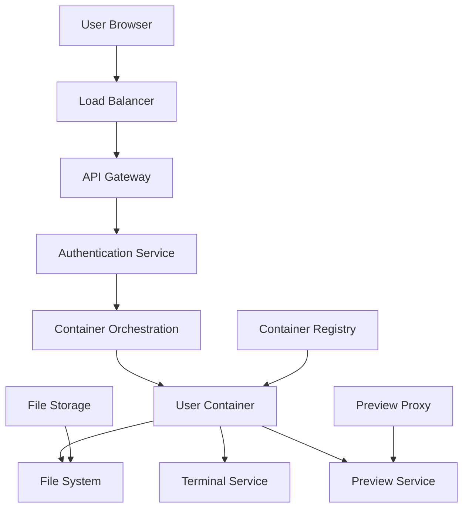

# Local to Cloud Migration Plan

This document outlines the complete strategy for migrating bolt.diy from its current browser-based architecture to a cloud-based platform while maintaining **identical functionality** without adding new features.

## Migration Objective

**Goal**: Replicate the exact same functionality that currently works in the browser (file creation/editing, terminal commands, live preview) in a cloud environment with no functionality changes or new features.

**Core Requirement**: Every feature that works locally must work identically in the cloud.

---

## Current Architecture Analysis

### What Works Locally (Browser-Based)

**WebContainer Technology:**
- **Virtual Node.js Runtime**: Full Node.js environment in browser using WebAssembly
- **Virtual File System**: In-memory file system with real-time watching
- **Virtual Terminal**: Shell commands executed in browser sandbox
- **Package Management**: Real npm install, yarn add with actual package downloads
- **Development Servers**: Vite, Next.js, Express servers running on virtual ports
- **Live Preview**: Applications served from virtual localhost with hot reload

**File Operations:**
- Create, read, update, delete files and folders
- Binary file support (images, PDFs, etc.)
- Real-time file watching and synchronization
- File locking during AI operations
- Import/export functionality (ZIP, Git clone)

**Terminal Capabilities:**
- Full shell access with command history
- Real-time command output streaming
- Multiple terminal sessions
- Interactive commands support
- Error handling and display

**Preview System:**
- Live application preview with hot reload
- Multiple port support (frontend + backend)
- Error overlay and debugging
- Real-time updates as code changes

---

## Cloud Architecture Design

### High-Level Architecture Replacement

**Current**: Browser → WebContainer API → Virtual Environment
**Cloud**: Browser → Load Balancer → Container Orchestration → Real Containers



---

## Core Component Replacements

### 1. WebContainer → Docker Containers

**Current WebContainer Functionality:**
```typescript
// Browser-based WebContainer
const webcontainer = await WebContainer.boot({
  coep: 'credentialless',
  workdirName: WORK_DIR_NAME,
  forwardPreviewErrors: true,
});
```

**Cloud Container Replacement:**
```yaml
# Docker container for each user project
apiVersion: v1
kind: Pod
metadata:
  name: workspace-${userId}-${projectId}
  labels:
    app: bolt-workspace
    user: ${userId}
    project: ${projectId}
spec:
  containers:
  - name: workspace
    image: bolt-workspace:latest
    resources:
      requests:
        memory: "1Gi"
        cpu: "500m"
      limits:
        memory: "2Gi"
        cpu: "1000m"
    env:
    - name: WORKSPACE_ID
      value: "${userId}-${projectId}"
    - name: USER_ID
      value: "${userId}"
    volumeMounts:
    - name: workspace-storage
      mountPath: /workspace
    ports:
    - containerPort: 3000
      name: dev-server
    - containerPort: 5173
      name: vite-server
    - containerPort: 8080
      name: preview
```

**Container Image Requirements:**
- **Base**: Node.js 20 with npm, yarn, pnpm
- **Tools**: Git, curl, wget, basic Unix utilities
- **Languages**: Support for Python, Go, Rust if needed
- **Security**: Non-root user, restricted capabilities
- **Initialization**: Auto-setup workspace structure

### 2. Virtual File System → Cloud Storage + Real File System

**Current File System:**
```typescript
// Browser memory-based file system
export class FilesStore {
  files: MapStore<FileMap> = map({});
  
  async saveFile(filePath: string, content: string) {
    await webcontainer.fs.writeFile(relativePath, content);
    this.files.setKey(filePath, { type: 'file', content, isBinary: false });
  }
}
```

**Cloud File System Architecture:**
```typescript
// Cloud-based file system with persistent storage
export class CloudFilesStore {
  private containerApiUrl: string;
  private storageService: StorageService;
  
  async saveFile(filePath: string, content: string) {
    // 1. Write to container file system via API
    await fetch(`${this.containerApiUrl}/files`, {
      method: 'POST',
      body: JSON.stringify({ path: filePath, content })
    });
    
    // 2. Backup to persistent storage
    await this.storageService.writeFile(filePath, content);
    
    // 3. Update UI state
    this.files.setKey(filePath, { type: 'file', content, isBinary: false });
  }
}
```

**Storage Layer:**
- **Container FS**: Ephemeral storage within container for active development
- **Persistent Storage**: Cloud storage (S3/GCS) for project backup and recovery
- **File Sync**: Real-time synchronization between browser UI and container
- **Version Control**: Git-based versioning for all file changes

### 3. Virtual Terminal → WebSocket Terminal Proxy

**Current Terminal:**
```typescript
// Browser-based terminal
const terminal = webcontainer.spawn('npm', ['install'], {
  output: true
});
```

**Cloud Terminal Service:**
```typescript
// WebSocket-based terminal proxy
export class CloudTerminalService {
  private ws: WebSocket;
  private containerId: string;
  
  executeCommand(command: string, cwd: string = '/workspace') {
    const payload = {
      type: 'execute',
      command,
      cwd,
      sessionId: generateId()
    };
    
    this.ws.send(JSON.stringify(payload));
  }
  
  onData(callback: (data: string) => void) {
    this.ws.onmessage = (event) => {
      const { type, data } = JSON.parse(event.data);
      if (type === 'terminal-output') {
        callback(data);
      }
    };
  }
}
```

**Terminal Infrastructure:**
- **WebSocket Gateway**: Real-time bidirectional communication
- **Container Shell Access**: Direct shell access to user containers
- **Session Management**: Multiple terminal sessions per user
- **Command History**: Persistent command history storage
- **Output Buffering**: Efficient handling of large command outputs

### 4. Virtual Preview → Cloud Preview Proxy

**Current Preview System:**
```typescript
// Browser-based preview
const previewUrl = await webcontainer.preview.getUrl(port);
```

**Cloud Preview System:**
```typescript
// Dynamic subdomain routing for previews
export class CloudPreviewService {
  async createPreview(userId: string, projectId: string, port: number) {
    const subdomain = `${userId}-${projectId}-${port}`;
    const previewUrl = `https://${subdomain}.preview.bolt.dev`;
    
    // Configure proxy routing
    await this.configureProxy(subdomain, `workspace-${userId}-${projectId}:${port}`);
    
    return previewUrl;
  }
}
```

**Preview Infrastructure:**
- **Dynamic Subdomains**: `user-project-port.preview.bolt.dev`
- **SSL Certificates**: Auto-generated SSL for all preview domains
- **Proxy Service**: Nginx/Traefik routing to container ports
- **Port Management**: Dynamic port allocation and routing
- **Error Handling**: Graceful handling of server startup/shutdown

---

## Detailed Migration Components

### 1. Container Orchestration Service

**Kubernetes Deployment:**
```yaml
# Container controller deployment
apiVersion: apps/v1
kind: Deployment
metadata:
  name: workspace-controller
spec:
  replicas: 3
  selector:
    matchLabels:
      app: workspace-controller
  template:
    spec:
      containers:
      - name: controller
        image: bolt-controller:latest
        env:
        - name: DOCKER_HOST
          value: "unix:///var/run/docker.sock"
        volumeMounts:
        - name: docker-socket
          mountPath: /var/run/docker.sock
        ports:
        - containerPort: 8080
```

**Controller Responsibilities:**
- **Container Lifecycle**: Create, manage, destroy user containers
- **Resource Management**: CPU, memory, disk allocation per user
- **Health Monitoring**: Container health checks and auto-restart
- **Scaling**: Auto-scale based on usage patterns
- **Cleanup**: Automated cleanup of idle containers

### 2. Real-Time Communication Infrastructure

**WebSocket Gateway:**
```typescript
// Real-time communication for file changes, terminal, etc.
@WebSocketGateway({ cors: { origin: '*' } })
export class BoltGateway {
  @SubscribeMessage('file-change')
  handleFileChange(client: Socket, payload: FileChangePayload) {
    // Broadcast file changes to all connected clients for same project
    this.server.to(`project-${payload.projectId}`).emit('file-updated', payload);
  }
  
  @SubscribeMessage('terminal-input')
  handleTerminalInput(client: Socket, payload: TerminalInputPayload) {
    // Forward terminal input to container
    this.forwardToContainer(payload.containerId, payload.data);
  }
}
```

**Communication Channels:**
- **File Operations**: Real-time file system changes
- **Terminal I/O**: Bidirectional terminal communication
- **Preview Updates**: Live preview refresh notifications
- **System Status**: Container health, build status, errors

### 3. File Synchronization Service

**File Sync Architecture:**
```typescript
export class FileSyncService {
  async syncFileChange(projectId: string, filePath: string, content: string) {
    // 1. Update container file system
    await this.updateContainerFile(projectId, filePath, content);
    
    // 2. Persist to cloud storage
    await this.persistToStorage(projectId, filePath, content);
    
    // 3. Broadcast to all connected clients
    this.broadcastFileChange(projectId, filePath, content);
    
    // 4. Trigger development server reload if needed
    await this.triggerHotReload(projectId);
  }
}
```

**Sync Features:**
- **Real-Time Updates**: Instant synchronization between UI and container
- **Conflict Resolution**: Handle simultaneous edits gracefully
- **Offline Support**: Queue changes when connection is lost
- **Batch Operations**: Efficiently handle multiple file changes

### 4. Preview and Port Management

**Dynamic Port Allocation:**
```typescript
export class PortManagerService {
  private allocatedPorts = new Map<string, number>();
  
  async allocatePort(projectId: string, serviceName: string): Promise<number> {
    const port = this.findAvailablePort();
    const key = `${projectId}-${serviceName}`;
    
    this.allocatedPorts.set(key, port);
    
    // Configure proxy routing
    await this.configureProxyRoute(key, port);
    
    return port;
  }
}
```

**Preview Features:**
- **Hot Reload**: Automatic refresh when files change
- **Multiple Services**: Support for frontend + backend + database
- **SSL Termination**: HTTPS for all preview URLs
- **Error Pages**: Custom error pages for failed services

---

## Data Storage Strategy

### 1. User Project Storage

**Storage Architecture:**
```
/projects/{userId}/{projectId}/
├── files/           # Project files
├── .git/           # Git repository
├── node_modules/   # Dependencies (cached)
├── dist/           # Build outputs
└── .bolt/          # Bolt-specific metadata
    ├── config.json
    ├── history.json
    └── locks.json
```

**Storage Services:**
- **Primary**: Cloud object storage (S3/GCS) for project files
- **Cache**: Redis for frequently accessed files and metadata
- **Database**: PostgreSQL for user data, project metadata
- **Git**: Managed Git repositories for version control

### 2. Container Storage

**Volume Management:**
```yaml
# Persistent volume for project data
apiVersion: v1
kind: PersistentVolumeClaim
metadata:
  name: workspace-${userId}-${projectId}
spec:
  accessModes:
    - ReadWriteOnce
  resources:
    requests:
      storage: 10Gi
  storageClassName: fast-ssd
```

**Storage Strategy:**
- **Container Filesystem**: Ephemeral, high-performance SSD
- **Persistent Volumes**: For project data that survives container restarts
- **Backup Storage**: Regular snapshots to object storage
- **Node Modules Cache**: Shared cache for common dependencies

---

## Authentication and Security

### 1. User Authentication

**Current State**: No authentication (anonymous browser sessions)
**Cloud State**: Required user accounts for container isolation

**Authentication Flow:**
```typescript
// JWT-based authentication
export class AuthService {
  async authenticateUser(token: string): Promise<User> {
    const decoded = jwt.verify(token, process.env.JWT_SECRET);
    return await this.userService.findById(decoded.userId);
  }
  
  async createUserContainer(userId: string, projectId: string) {
    // Ensure user can only access their own containers
    const user = await this.authenticateUser(userId);
    return await this.containerService.create(user.id, projectId);
  }
}
```

### 2. Security Isolation

**Container Security:**
- **User Namespaces**: Each user runs in isolated namespace
- **Resource Limits**: CPU, memory, disk, network limits
- **Network Isolation**: Containers can't access other user data
- **Capability Restrictions**: Minimal container capabilities
- **Read-Only Root**: Container root filesystem is read-only

**API Security:**
- **JWT Authentication**: All API requests require valid JWT
- **Rate Limiting**: Per-user API rate limits
- **Input Validation**: Strict validation of all inputs
- **CORS**: Proper CORS configuration for browser security

---

## API Design

### 1. Container Management API

**Endpoints:**
```typescript
// Container lifecycle management
POST   /api/containers                    # Create new container
GET    /api/containers/{id}               # Get container status
DELETE /api/containers/{id}               # Destroy container
POST   /api/containers/{id}/start         # Start container
POST   /api/containers/{id}/stop          # Stop container

// File operations
GET    /api/containers/{id}/files         # List files
POST   /api/containers/{id}/files         # Create/update file
DELETE /api/containers/{id}/files/{path}  # Delete file

// Terminal operations
POST   /api/containers/{id}/terminal      # Create terminal session
WS     /ws/containers/{id}/terminal/{sessionId} # Terminal WebSocket

// Preview management
GET    /api/containers/{id}/preview       # Get preview URLs
POST   /api/containers/{id}/preview/{port} # Create preview for port
```

### 2. File System API

**File Operations:**
```typescript
// RESTful file system API
interface FileSystemAPI {
  // File CRUD operations
  createFile(path: string, content: string): Promise<void>;
  readFile(path: string): Promise<string>;
  updateFile(path: string, content: string): Promise<void>;
  deleteFile(path: string): Promise<void>;
  
  // Directory operations
  createDirectory(path: string): Promise<void>;
  listDirectory(path: string): Promise<FileInfo[]>;
  
  // Batch operations
  batchUpdate(operations: FileOperation[]): Promise<void>;
  
  // File watching
  watchFiles(paths: string[]): Promise<EventStream>;
}
```

---

## Migration Implementation Plan

### Phase 1: Infrastructure Setup (Weeks 1-4)

**Week 1-2: Core Infrastructure**
- Set up Kubernetes cluster
- Configure container registry  
- Implement basic container orchestration
- Set up cloud storage integration

**Week 3-4: Networking & Security**
- Configure load balancers and ingress
- Implement SSL certificate management
- Set up preview proxy system
- Basic authentication and authorization

### Phase 2: Core Services (Weeks 5-10)

**Week 5-6: Container Service**
- Container lifecycle management
- Resource allocation and limits
- Health monitoring and auto-restart
- Container image optimization

**Week 7-8: File System Service**
- Real-time file synchronization
- Cloud storage integration
- File watching and notifications
- Conflict resolution

**Week 9-10: Terminal Service**
- WebSocket terminal proxy
- Multiple session support
- Command history and persistence
- Security and input validation

### Phase 3: Preview System (Weeks 11-14)

**Week 11-12: Preview Infrastructure**
- Dynamic subdomain routing
- Port management and allocation
- SSL certificate automation
- Error handling and monitoring

**Week 13-14: Hot Reload & Development**
- File change detection
- Development server integration
- Hot module replacement
- Build system integration

### Phase 4: Integration & Testing (Weeks 15-20)

**Week 15-16: UI Integration**
- Update frontend to use cloud APIs
- WebSocket client implementation
- Error handling and retry logic
- Loading states and user feedback

**Week 17-18: Testing & Optimization**
- Load testing and performance optimization
- Security testing and hardening
- User acceptance testing
- Bug fixes and refinements

**Week 19-20: Deployment & Migration**
- Production deployment
- Data migration tools
- Rollback procedures
- Monitoring and alerting

---

## Technical Challenges & Solutions

### 1. Real-Time Synchronization

**Challenge**: Maintaining real-time sync between browser UI and cloud containers
**Solution**: WebSocket-based event streaming with optimistic updates and conflict resolution

### 2. Container Resource Management

**Challenge**: Efficiently managing container resources for potentially thousands of users
**Solution**: Auto-scaling, resource quotas, idle container cleanup, and shared dependency caching

### 3. Preview URL Management

**Challenge**: Dynamic preview URLs with SSL for each user project
**Solution**: Wildcard SSL certificates with automated subdomain routing via proxy service

### 4. File System Performance

**Challenge**: Fast file operations while maintaining persistence
**Solution**: Container-local file system with background sync to persistent storage

### 5. Development Server Integration

**Challenge**: Supporting various development servers (Vite, Next.js, etc.) in containers
**Solution**: Smart detection and configuration of development servers with port forwarding

---

## Cost Optimization Strategies

### 1. Resource Efficiency

**Container Optimization:**
- **Shared Base Images**: Common dependencies in shared layers
- **Idle Cleanup**: Automatic cleanup of inactive containers
- **Resource Limits**: Prevent resource abuse with proper limits
- **Spot Instances**: Use cheaper spot instances for development workloads

### 2. Storage Optimization

**Storage Strategy:**
- **Tiered Storage**: Hot data on SSD, cold data on cheaper storage
- **Compression**: Compress stored project data
- **Deduplication**: Deduplicate common files across projects
- **Lifecycle Policies**: Automatic cleanup of old project versions

### 3. Network Optimization

**Bandwidth Savings:**
- **CDN Integration**: Serve common assets from CDN
- **Compression**: Gzip/Brotli compression for all API responses
- **WebSocket Optimization**: Efficient binary protocols for real-time data
- **Caching**: Aggressive caching of static assets and API responses

---

## Monitoring and Observability

### 1. System Metrics

**Infrastructure Monitoring:**
- **Container Health**: CPU, memory, disk usage per container
- **API Performance**: Response times, error rates, throughput
- **Storage Metrics**: Storage usage, I/O performance
- **Network Metrics**: Bandwidth usage, connection counts

### 2. User Experience Monitoring

**UX Metrics:**
- **Response Times**: File save, terminal command, preview load times
- **Error Rates**: Failed operations, container crashes
- **User Sessions**: Active users, session duration
- **Feature Usage**: Most used features, user workflows

### 3. Business Metrics

**Operational Metrics:**
- **Resource Costs**: Container hours, storage costs, bandwidth
- **User Engagement**: Daily/monthly active users, project creation
- **System Utilization**: Peak usage patterns, capacity planning
- **Support Metrics**: Error tickets, user feedback

---

## Success Criteria

### 1. Functional Parity

**Must Have:**
- ✅ All current file operations work identically
- ✅ Terminal commands execute with same output
- ✅ Live preview works with hot reload
- ✅ Package installation works (npm, yarn, pnpm)
- ✅ Development servers start and run properly
- ✅ AI integration works without changes

### 2. Performance Targets

**Response Times:**
- File operations: < 200ms
- Terminal commands: < 100ms initial response
- Preview loading: < 3 seconds
- Container startup: < 30 seconds

### 3. Reliability Targets  

**Uptime & Availability:**
- 99.9% API availability
- 99.5% container availability
- < 1% data loss rate
- Auto-recovery from failures

### 4. Scalability Targets

**Scale Requirements:**
- Support 10,000+ concurrent users
- Handle 100,000+ projects
- Auto-scale based on demand
- Linear cost scaling with usage

---

## Risk Mitigation

### 1. Technical Risks

**Container Security**: Implement proper isolation, monitoring, and regular security updates
**Data Loss**: Multiple backup strategies, version control, and disaster recovery
**Performance Issues**: Load testing, performance monitoring, and optimization
**Scaling Problems**: Gradual rollout, capacity planning, and monitoring

### 2. Migration Risks

**User Disruption**: Phased migration with fallback to local version
**Data Migration**: Comprehensive testing of migration tools and processes
**Feature Regressions**: Extensive testing and user acceptance testing
**Performance Degradation**: Performance benchmarking and optimization

---

This migration plan ensures that every aspect of the current local functionality is replicated in the cloud environment while maintaining the exact same user experience and feature set.