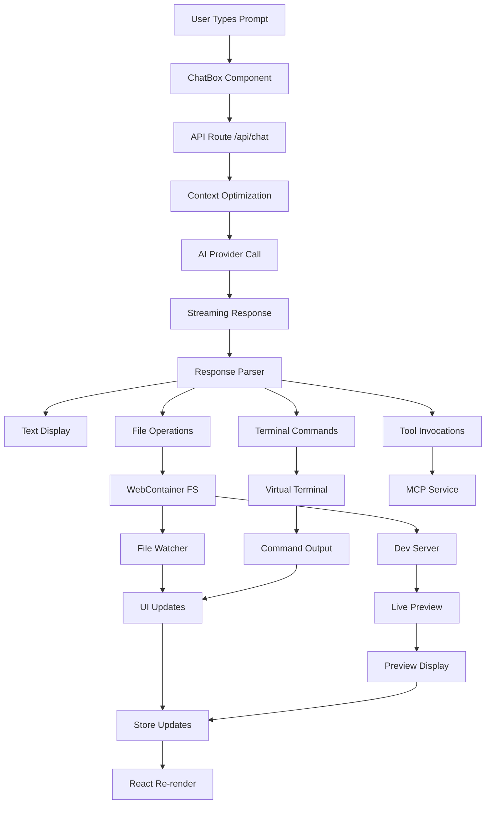

# Complete Flow: From Prompt Input to Live Preview

This document provides a comprehensive breakdown of every step that occurs when you submit a prompt to bolt.diy, from the initial input to seeing your application running in the preview pane.

## Overview

bolt.diy uses a sophisticated pipeline that combines AI language models, WebContainer technology, and real-time streaming to provide an instant development environment. Here's the complete journey:

**High-Level Flow:**
```
User Prompt → AI Processing → File Operations → Terminal Commands → Live Preview
```

---

## Phase 1: Prompt Input & Initial UI State

### 1.1 Chat Input Component (`/app/components/chat/ChatBox.tsx`)

**What happens when you type:**
- **TextArea Capture**: Your prompt is captured in a controlled textarea component
- **File Upload Processing**: Any attached images/PDFs are converted to base64 and stored
- **Model Selection**: Your chosen AI model (GPT-4, Claude, etc.) is validated
- **Provider Settings**: API keys and model configurations are retrieved from cookies

**UI State Changes:**
- Chat input becomes disabled with loading state
- Streaming indicator (animated dots) appears
- Send button transforms into a "Stop" button
- Model selector shows loading state if needed

### 1.2 Message Preparation

**File Processing:**
- Uploaded images are converted to base64 data URLs
- File attachments are processed and prepared for AI context
- Previous chat history is loaded and formatted

**Request Building:**
```typescript
// Request structure sent to API
{
  messages: Message[], // Chat history + new prompt
  files: FileMap,      // Current project files
  contextOptimization: boolean, // Smart file selection
  chatMode: 'discuss' | 'build',
  designScheme?: DesignScheme,
  maxLLMSteps: number
}
```

---

## Phase 2: API Processing & Context Optimization

### 2.1 API Route Handler (`/app/routes/api.chat.ts`)

**Request Processing:**
1. **Cookie Parsing**: Extracts API keys and provider settings from cookies
2. **Message Validation**: Validates message format and content
3. **Stream Initialization**: Sets up streaming response infrastructure
4. **MCP Service**: Initializes Model Context Protocol service for tool handling

### 2.2 Context Optimization (Smart File Selection)

**When you have many files:**
```typescript
// Context optimization process
if (filePaths.length > 0 && contextOptimization) {
  // Generate summary of conversation
  summary = await createSummary({ messages, ... });
  
  // AI selects only relevant files
  filteredFiles = await selectContext({ 
    messages, 
    files, 
    summary 
  });
}
```

**What this does:**
- **File Analysis**: AI analyzes all project files
- **Relevance Scoring**: Determines which files are relevant to your prompt
- **Token Optimization**: Reduces context size for better performance
- **Summary Generation**: Creates conversation summary for context

### 2.3 AI Provider Selection & Configuration

**Provider Pipeline:**
1. **Model Validation**: Ensures selected model is available
2. **API Key Verification**: Validates API keys for chosen provider
3. **Rate Limit Handling**: Manages API rate limits and quotas
4. **Streaming Setup**: Configures streaming parameters for real-time response

---

## Phase 3: AI Response Generation & Streaming

### 3.1 AI API Communication

**Request to AI Provider:**
```typescript
const result = await streamText({
  messages: processedMessages,
  tools: mcpService.toolsWithoutExecute,
  maxSteps: maxLLMSteps,
  onStepFinish: ({ toolCalls }) => {
    // Process each tool call (file operations, terminal commands)
    toolCalls.forEach(toolCall => 
      mcpService.processToolCall(toolCall, dataStream)
    );
  }
});
```

**Streaming Process:**
- **Chunk Reception**: AI response arrives in real-time chunks
- **Immediate Forwarding**: Each chunk sent to UI immediately
- **Action Parsing**: Chunks analyzed for file operations and commands
- **Tool Invocations**: Special actions (file creation, terminal commands) extracted

### 3.2 Real-Time UI Updates

**Message Display (`/app/components/chat/Messages.client.tsx`):**
- **Character-by-Character**: Text appears as AI generates it
- **Markdown Rendering**: Real-time markdown formatting
- **Code Block Highlighting**: Syntax highlighting applied instantly
- **Action Indicators**: Shows "Creating file...", "Running command..." states

**Progress Tracking:**
```typescript
// Progress annotations shown in UI
type ProgressAnnotation = {
  type: 'file-creation' | 'command-execution' | 'package-install';
  status: 'pending' | 'in-progress' | 'completed' | 'failed';
  message: string;
};
```

---

## Phase 4: File System Operations

### 4.1 File Creation & Updates (`/app/lib/stores/files.ts`)

**File Management Process:**
1. **AI Action Parsing**: Extracts file operations from AI response
2. **Path Validation**: Ensures file paths are valid and safe
3. **Content Processing**: Handles text files and binary files differently
4. **WebContainer Write**: Writes files to virtual file system

**File Creation Flow:**
```typescript
async createFile(filePath: string, content: string | Uint8Array) {
  // 1. Validate path
  const relativePath = path.relative(webcontainer.workdir, filePath);
  
  // 2. Create directory structure
  await webcontainer.fs.mkdir(dirPath, { recursive: true });
  
  // 3. Write file content
  await webcontainer.fs.writeFile(relativePath, content);
  
  // 4. Update UI store
  this.files.setKey(filePath, {
    type: 'file',
    content,
    isBinary: false,
    isLocked: false
  });
}
```

### 4.2 File Watching & UI Synchronization

**Real-Time File Updates:**
1. **WebContainer Watcher**: Monitors all file system changes
2. **Event Buffering**: Buffers rapid changes to prevent UI flooding
3. **Store Updates**: Updates Nanostores with file changes
4. **UI Reactivity**: File tree and editor automatically update

**File Lock Management:**
- **Lock During AI Operations**: Prevents user edits during AI modifications
- **Visual Indicators**: Locked files shown with different styling
- **Auto-Unlock**: Locks automatically released when AI finishes

### 4.3 Binary File Handling

**Asset Management:**
```typescript
// Binary file detection and handling
const isBinary = isBinaryFile(buffer);

if (isBinary) {
  // Store as base64 for binary files
  const base64Content = Buffer.from(content).toString('base64');
  this.files.setKey(filePath, {
    type: 'file',
    content: base64Content,
    isBinary: true
  });
}
```

---

## Phase 5: Terminal Operations & Command Execution

### 5.1 Terminal Interface (`/app/components/workbench/terminal/`)

**Command Execution Pipeline:**
1. **AI Command Generation**: AI generates terminal commands (npm install, npm run dev)
2. **Command Validation**: Commands are validated for security
3. **WebContainer Execution**: Commands run in virtual shell environment
4. **Real-Time Output**: Command output streams to terminal UI

**Terminal Features:**
- **Multiple Sessions**: Support for multiple terminal tabs
- **Command History**: Previous commands stored and accessible
- **Interactive Commands**: Support for interactive prompts
- **Error Handling**: Command failures are captured and displayed

### 5.2 Package Management

**NPM/Yarn Operations:**
```typescript
// Package installation process
await webcontainer.spawn('npm', ['install'], {
  cwd: '/workspace',
  output: true // Stream output to terminal
});
```

**What Actually Happens:**
- **Real Package Downloads**: Packages are actually downloaded from npm registry
- **node_modules Creation**: Full node_modules directory created in virtual FS
- **Dependency Resolution**: Package.json dependencies fully resolved
- **File Tree Updates**: node_modules appears in file explorer

---

## Phase 6: Development Server & Live Preview

### 6.1 Development Server Startup

**Server Initialization:**
1. **Framework Detection**: Automatically detects framework (React, Vue, Next.js, etc.)
2. **Dev Server Start**: Runs framework-specific dev server commands
3. **Port Assignment**: WebContainer assigns available ports
4. **Health Checks**: Monitors server startup and health

**Server Types Supported:**
- **Vite**: `npm run dev` on port 5173
- **Next.js**: `npm run dev` on port 3000
- **Create React App**: `npm start` on port 3000
- **Express**: Custom port configuration
- **Static Sites**: Built-in HTTP server

### 6.2 Preview System (`/app/components/workbench/Preview.tsx`)

**Preview Display:**
```typescript
// Preview URL generation
const previewUrl = await webcontainer.preview.getUrl(port);

// IFrame embedding
<iframe 
  src={previewUrl}
  onLoad={handlePreviewLoad}
  onError={handlePreviewError}
/>
```

**Features:**
- **Hot Reload**: Changes automatically refresh preview
- **Multiple Ports**: Support for frontend + backend on different ports
- **Error Overlay**: Development errors shown in preview
- **Console Integration**: Browser console output captured

### 6.3 Real-Time Updates

**File Change → Preview Update Flow:**
1. **File Modified**: User or AI modifies a file
2. **WebContainer Detects**: File watcher detects change
3. **Dev Server Rebuild**: Development server rebuilds application
4. **Hot Module Replacement**: Changes injected without full reload
5. **Preview Updates**: New version appears in preview pane

---

## Phase 7: State Management & UI Coordination

### 7.1 Store Architecture (Nanostores)

**Key Stores:**
```typescript
// Chat state management
export const chatStore = map({
  messages: [],
  isStreaming: false,
  selectedModel: 'gpt-4'
});

// File system state
export const filesStore = map({
  files: {},
  selectedFile: null,
  isLoading: false
});

// Workbench state
export const workbenchStore = map({
  currentView: 'code',
  previewUrl: null,
  terminalOutput: []
});
```

### 7.2 Real-Time Synchronization

**State Update Flow:**
1. **Action Triggered**: User action or AI response
2. **Store Update**: Relevant Nanostores updated
3. **Component Reactivity**: React components automatically re-render
4. **UI Consistency**: All UI elements stay synchronized

### 7.3 Error Handling & Recovery

**Error Management:**
- **API Errors**: Network issues, rate limits, invalid API keys
- **File System Errors**: Invalid paths, permission issues
- **Terminal Errors**: Command failures, syntax errors
- **Preview Errors**: Build failures, runtime errors

**Recovery Mechanisms:**
- **Automatic Retry**: Failed operations retry with exponential backoff
- **Error Display**: Clear error messages with suggested fixes
- **State Recovery**: UI state restored after errors
- **Graceful Degradation**: Core functionality maintained during partial failures

---

## Complete Data Flow Diagram



---

## Key Files & Components

### Core Chat Components
- `app/components/chat/BaseChat.tsx` - Main chat interface
- `app/components/chat/ChatBox.tsx` - Input area with model selector
- `app/components/chat/Messages.client.tsx` - Message display with streaming
- `app/components/chat/SendButton.client.tsx` - Send button with state management

### API & AI Processing
- `app/routes/api.chat.ts` - Main API endpoint for chat processing
- `app/lib/.server/llm/stream-text.ts` - AI provider communication
- `app/lib/.server/llm/select-context.ts` - Smart file selection
- `app/lib/services/mcpService.ts` - Model Context Protocol handling

### File System Management
- `app/lib/stores/files.ts` - File system state management
- `app/lib/webcontainer/index.ts` - WebContainer initialization
- `app/utils/diff.ts` - File change detection and diffing

### Workbench & Preview
- `app/components/workbench/Workbench.client.tsx` - Main workspace
- `app/components/workbench/Preview.tsx` - Live preview display
- `app/components/workbench/terminal/Terminal.tsx` - Terminal interface

### State Management
- `app/lib/stores/` - Various Nanostores for state management
- `app/lib/hooks/` - Custom React hooks for store integration

---

## Performance Optimizations

### Context Management
- **Smart File Selection**: Only relevant files sent to AI
- **Conversation Summarization**: Long chats summarized to save tokens
- **Streaming Response**: Immediate UI feedback during AI generation

### UI Performance
- **Virtual Scrolling**: Efficient rendering of large file lists
- **Debounced Updates**: File changes batched to prevent UI flooding
- **Code Splitting**: Lazy loading of heavy components

### Memory Management
- **File Content Caching**: Intelligent caching of file contents
- **WebContainer Optimization**: Efficient use of virtual file system
- **Garbage Collection**: Cleanup of unused state and event listeners

This complete flow ensures a seamless experience from prompt input to live application preview, with real-time feedback at every step of the process.